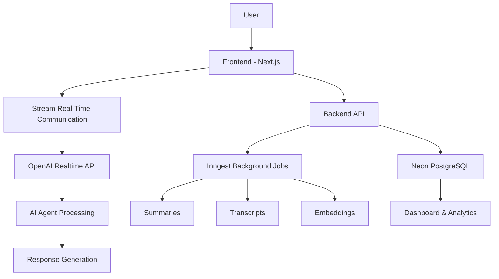

# 🤖 MeetAI — AI-Powered Intelligent Conversational Agent Platform

<div align="center">


### 🚀 Real-Time Human–AI Conversations Powered by Modern AI Infrastructure

*An intelligent SaaS platform where users can interact with specialized AI agents through natural, real-time voice conversations.*

</div>

---

## 📖 Overview

MeetAI is a next-generation AI conversational platform that enables **real-time human–AI interaction** through voice communication. Unlike traditional communication platforms that focus on connecting people, MeetAI connects users directly with intelligent AI agents capable of understanding context, maintaining conversation history, and generating meaningful responses.

The platform combines **real-time communication technologies**, **Large Language Models (LLMs)**, and **modern cloud infrastructure** to create a seamless and intelligent conversational experience.

Whether you're practicing interviews, learning a language, preparing sales pitches, or seeking personalized assistance, MeetAI provides a specialized AI agent tailored to your needs.

---
# 🌟 Project Highlights

- 🎙️ Real-Time Human–AI Voice Conversations
- 🧠 Context-Aware AI Agents with Memory
- ⚡ Low-Latency Speech-to-Speech Interaction
- 🎭 Multiple AI Personas (Interviewer, Tutor, Coach, Assistant)
- ☁️ Modern SaaS Architecture
- 🔐 Secure Authentication & Session Management
- 📊 Automatic Conversation Analytics
- 📝 AI-Generated Summaries and Insights
- 🔄 Event-Driven Background Processing with Inngest
- 🗄️ Scalable Serverless PostgreSQL Database
- 🚀 Built with Next.js 15, React 19, and TypeScript
- 🤖 Powered by OpenAI Realtime AI Models

---
## ✨ Key Features

### 🎙️ Real-Time Voice Conversations
- Low-latency audio communication
- Near real-time AI responses
- Natural conversational experience
- Continuous interaction flow

### 🧠 Context-Aware AI Agents
- Maintains conversation memory
- Tracks topics and discussion flow
- Generates intelligent responses
- Understands conversational context

### 🎭 Specialized Agent Personas
Choose from multiple AI personalities:

- 👨‍💼 Interview Coach
- 🗣️ Language Tutor
- 💰 Sales Coach
- 📚 Learning Assistant
- 🎯 Career Mentor
- 🤝 Personal Assistant

### 📊 Conversation Intelligence
- Automatic transcripts
- AI-generated summaries
- Action item extraction
- Conversation analytics

### ☁️ SaaS Architecture
- Secure authentication
- Scalable cloud infrastructure
- Subscription-ready architecture
- Multi-session support

---

# 🏗️ System Architecture



---

# 🛠️ Tech Stack

## Frontend

| Technology | Purpose |
|------------|----------|
| Next.js 15 | Full-stack Framework |
| React 19 | UI Components |
| TypeScript | Type Safety |
| Tailwind CSS | Styling |
| Shadcn/UI | UI Components |

---

## Backend

| Technology | Purpose |
|------------|----------|
| Next.js API Routes | Backend Services |
| tRPC | Type-Safe APIs |
| Better Auth | Authentication |
| Polar | SaaS Billing |

---

## AI & Communication

| Technology | Purpose |
|------------|----------|
| OpenAI Realtime API | AI Conversations |
| Stream Video SDK | Real-Time Communication |
| Stream Chat SDK | Messaging Infrastructure |

---

## Database & Infrastructure

| Technology | Purpose |
|------------|----------|
| Neon PostgreSQL | Database |
| Drizzle ORM | Database Management |
| Inngest | Background Processing |

---

# ⚙️ How MeetAI Works

### Step 1: User Authentication
Users securely sign in to the platform using Better Auth.

### Step 2: Agent Selection
Users select a specialized AI agent based on their needs.

### Step 3: Session Initialization
A real-time communication session is established.

### Step 4: Voice Streaming
User audio is streamed to the AI processing layer.

### Step 5: AI Processing
The AI agent:
- Understands the speech
- Maintains context
- Generates a response

### Step 6: Real-Time Response
The response is returned to the user with minimal latency.

### Step 7: Data Persistence
Conversation data and session metadata are stored securely.

### Step 8: Background Intelligence
Inngest workflows generate:
- Summaries
- Transcripts
- Insights
- Searchable embeddings

---

# 📂 Project Structure

```bash
meetai/
│
├── src/
│   ├── app/
│   ├── components/
│   ├── modules/
│   ├── hooks/
│   ├── lib/
│   ├── db/
│   └── trpc/
│
├── public/
│
├── drizzle/
│
├── inngest/
│
├── middleware.ts
├── drizzle.config.ts
├── next.config.ts
├── package.json
└── README.md
```

---

# 🧠 Why This Project Matters

Traditional communication systems primarily act as passive channels for interaction.

MeetAI transforms communication by introducing:

✅ Intelligent participation  
✅ Context awareness  
✅ Cognitive assistance  
✅ Automated understanding  
✅ Personalized interaction  

This represents a significant step toward the future of Human–AI Collaboration.

---

# 🎯 Applications

### 👨‍💼 Interview Preparation
Practice technical and HR interviews with an AI interviewer.

### 🗣️ Language Learning
Improve speaking skills through interactive conversations.

### 💰 Sales Training
Refine pitches, objection handling, and negotiation skills.

### 📚 Education
Receive personalized tutoring and learning support.

### 🎯 Career Guidance
Discuss career paths and professional development.

### 🤝 Personal Productivity
Interact with AI assistants for planning and decision-making.

---

# 📈 Industrial Use Cases

- Corporate Training
- Customer Support Simulation
- AI-Powered Coaching
- Recruitment Assistance
- Professional Skill Development
- Enterprise Productivity Systems
- Employee Onboarding
- Communication Training

---

# 🔒 Security Features

- Secure Authentication
- Protected API Routes
- Environment Variable Protection
- Database Security
- Session Management
- Role-Based Access Control

---


# 🎓 Academic Contribution

This project was developed as part of the Bachelor of Technology program in **Robotics and Artificial Intelligence** and explores the integration of:

- Human–AI Interaction
- Conversational Intelligence
- Real-Time Systems
- SaaS Architecture
- Large Language Models
- Event-Driven Processing

---

# 📚 Research Focus Areas

- Conversational AI
- Agentic Systems
- Human–Computer Interaction
- Real-Time Communication
- AI-Assisted Collaboration
- Cloud-Native Architectures

---

# 📜 License

This project is licensed under the MIT License.

---

# 👨‍💻 Author

### Mohil Wankar

Robotics & Artificial Intelligence Student  
Priyadarshini College of Engineering, Nagpur

🔗 GitHub: https://github.com/Mohil-Wankar

---

<div align="center">

### ⭐ If you found this project interesting, consider giving it a star!

**MeetAI — Empowering Real-Time Human–AI Conversations**

</div>
